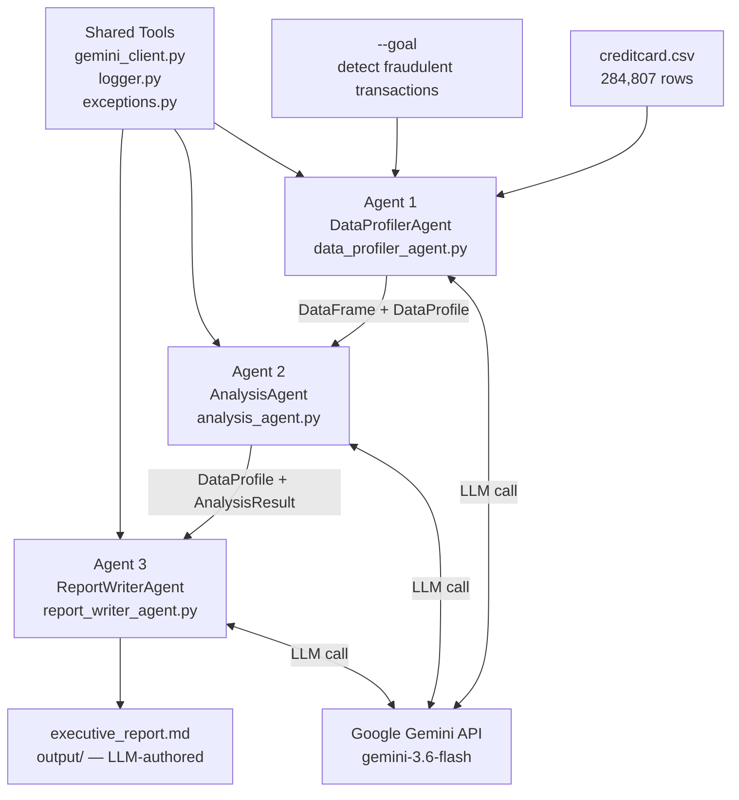

# Design Document — Brazilian Fintech Agents

> **Status:** Final  
> **Version:** 2.0.0  
> **Date:** 2026-09-13  
> **References:** [spec.md](../spec/spec.md), [challenge.md](../challenge.md)

---


## 1. High-Level Architecture

The system is a **sequential LLM-driven data-flow pipeline** composed of three autonomous agents and one orchestrator. Each agent encapsulates its logic in a single class exposing a `.run()` method. Agents communicate through typed Python dataclasses. The analysis goal is propagated through all agents, driving LLM reasoning at each step.

```
[creditcard.csv]  +  [goal: "detect fraudulent transactions"]
        │
        ▼
main.py (Orchestrator)
  │
  ├──[1] DataProfilerAgent.run(csv_path, goal)
  │        └──► (DataFrame, DataProfile)
  │
  ├──[2] AnalysisAgent.run(df, data_profile)
  │        └──► AnalysisResult
  │
  └──[3] ReportWriterAgent.run(data_profile, analysis_result)
           └──► writes output/executive_report.md
```

### Design Principles

| Principle | Decision |
|-----------|----------|
| **Goal-driven reasoning** | The analysis goal is passed explicitly to Agent 1, which uses it to guide all LLM reasoning — field relevance, analysis prescription, fraud signal identification |
| **LLM for semantics, pandas for computation** | Gemini handles understanding and narration; pandas/numpy handle statistics and data manipulation |
| **Single Responsibility** | Each agent has exactly one job; no cross-agent logic |
| **Immutable data contracts** | Agents communicate via typed dataclasses (no shared global state) |
| **Graceful fallback** | Every LLM call has a pandas-only fallback; the pipeline never crashes due to API unavailability |
| **Dataset-agnostic** | The pipeline works on any CSV — `--goal` is the only domain-specific parameter |
| **Testability** | Each agent can be unit-tested in isolation with mock inputs |

---

## 2. Project Module Layout

```
brazilian-fintech-agents/
│
├── challenge.md
│
├── spec/
│   └── spec.md
│
├── design/
│   ├── design.md                    ← this file
│   └── architecture_diagram.png    ← v2 pipeline diagram
│
├── dataset/
│   ├── creditcard.csv               ← git-ignored (143MB)
│   └── dataset-readme.md
│
├── tools/
│   ├── __init__.py
│   ├── gemini_client.py             ← Gemini SDK wrapper (new)
│   ├── logger.py                    ← centralised logging
│   ├── exceptions.py                ← SchemaValidationError, DataQualityError
│   └── markdown_helpers.py         ← table/section builders (fallback)
│
├── agents/
│   ├── __init__.py
│   ├── data_profiler_agent.py       ← Agent 1 (LLM schema understanding)
│   ├── analysis_agent.py            ← Agent 2 (pandas + LLM interpretation)
│   ├── report_writer_agent.py       ← Agent 3 (LLM report authoring)
│   ├── ingestion_agent.py           ← v1 legacy (kept for reference)
│   └── eda_agent.py                 ← v1 legacy (kept for reference)
│
├── models/
│   ├── __init__.py
│   ├── data_profile.py              ← DataProfile dataclass (new)
│   ├── analysis_result.py           ← AnalysisResult dataclass (new)
│   ├── data_summary.py              ← v1 legacy
│   └── eda_results.py               ← v1 legacy
│
├── output/
│   └── executive_report.md          ← pipeline output (git-ignored)
│
├── .env.example                     ← API key template (new)
├── technical_report.md              ← architecture decisions (EN)
├── technical_report_pt_br.md        ← architecture decisions (PT-BR)
├── main.py                          ← orchestrator entry point
├── requirements.txt
└── README.md
```

---

## 3. Data Contracts (Models)

All inter-agent data is passed as **Python dataclasses** for type safety and IDE support.

### 3.1 `DataProfile` — output of Agent 1

```python
# models/data_profile.py

@dataclass
class FieldProfile:
    name: str
    dtype: str
    null_count: int
    description: str          # LLM: what this field represents
    role: str                 # "target" | "temporal_index" | "key_numeric" | "pca_feature" | "unknown"
    relevant_to_goal: bool    # LLM: does this field matter for the goal?
    relevance_reason: str     # LLM: explanation of why / why not

@dataclass
class PrescribedAnalysis:
    name: str           # e.g. "class_imbalance"
    description: str    # what to compute
    goal_link: str      # how this analysis helps achieve the goal

@dataclass
class DataProfile:
    dataset_name: str
    analysis_goal: str                        # propagated through all agents
    shape: Tuple[int, int]
    fields: List[FieldProfile]
    target_field: Optional[str]               # LLM-identified target column
    domain: str                               # e.g. "Credit card fraud detection"
    fraud_signal_fields: List[str]            # LLM-identified high-signal columns
    prescribed_analyses: List[PrescribedAnalysis]   # what Agent 2 must run
    llm_summary: str
    generated_by: str                         # "llm" | "fallback"
```

---

### 3.2 `AnalysisResult` — output of Agent 2

```python
# models/analysis_result.py

@dataclass
class RiskWindow:
    hour_bin: int
    tx_count: int
    fraud_count: int
    fraud_rate_pct: float

@dataclass
class FeatureSignal:
    feature: str
    correlation: float
    interpretation: str   # LLM explanation of this feature's fraud signal

@dataclass
class OutlierRecord:
    index: int
    amount: float
    is_fraud: bool

@dataclass
class AnalysisResult:
    # Computed by pandas
    class_distribution: Dict[str, int]
    fraud_rate_pct: float
    amount_mean: float
    amount_std: float
    amount_percentiles: Dict[str, float]
    outlier_threshold: float
    outliers: List[OutlierRecord]
    risk_windows: List[RiskWindow]
    top_risk_windows: List[RiskWindow]
    feature_signals: List[FeatureSignal]
    fraud_amount_mean: float
    legit_amount_mean: float

    # Generated by LLM (Gemini)
    llm_interpretation: str
    llm_anomaly_narrative: str
    llm_key_findings: List[str]
    llm_actionable_insights: List[Dict]   # [{title, finding, recommended_action}]

    generated_by: str   # "llm" | "fallback"
```

---

## 4. Agent Interface Design

All agents follow the same interface pattern:

```python
class BaseAgent:
    VERSION: str = "0.2.0"

    def run(self, *args, **kwargs):
        raise NotImplementedError
```

---

### 4.1 Agent 1 — `DataProfilerAgent`

```python
# agents/data_profiler_agent.py

class DataProfilerAgent(BaseAgent):
    """
    Uses LLM to semantically understand any CSV dataset in the
    context of a user-defined analysis goal.

    Prescribes which analyses Agent 2 should run and why.
    """
    VERSION = "0.2.0"
    NULL_THRESHOLD_PCT = 0.20
    SAMPLE_ROWS = 5

    def run(self, csv_path: str, goal: str) -> Tuple[pd.DataFrame, DataProfile]:
        ...
```

**Internal method breakdown:**

| Method | Responsibility |
|--------|---------------|
| `_load(csv_path)` | Read CSV; detect file-not-found |
| `_validate_nulls(df)` | Raise `DataQualityError` if any column > 20% null |
| `_clean(df)` | Drop duplicates; impute nulls; coerce numeric types |
| `_compute_structural_meta(df)` | Shape, dtypes, null counts, sample rows, `describe()` |
| `_build_prompt(meta, goal)` | Construct mission-aware prompt for Gemini |
| `_parse_profile(raw, df, goal)` | Parse Gemini JSON → `DataProfile` dataclass |
| `_fallback_profile(df, meta, goal)` | Pandas-only profile if LLM unavailable |

**LLM Prompt strategy:**
```
Your mission is: "{goal}"
Given this CSV schema with sample values: [columns + dtypes + samples]
Answer: field roles, relevance to goal, target variable, prescribed analyses, fraud signals.
Respond in JSON → DataProfile schema.
```

---

### 4.2 Agent 2 — `AnalysisAgent`

```python
# agents/analysis_agent.py

class AnalysisAgent(BaseAgent):
    """
    Executes analyses prescribed by DataProfilerAgent using pandas/numpy,
    then uses Gemini to interpret findings in the context of the goal.
    """
    VERSION = "0.2.0"
    IQR_MULTIPLIER = 3.0
    MAX_OUTLIERS = 20
    TOP_WINDOWS = 5
    TOP_FEATURES = 10

    def run(self, df: pd.DataFrame, profile: DataProfile) -> AnalysisResult:
        ...
```

**Internal method breakdown:**

| Method | Responsibility |
|--------|---------------|
| `_resolve_target(df, profile)` | Identify target column from profile or heuristics |
| `_resolve_amount_col(df, profile)` | Identify monetary value column |
| `_resolve_time_col(df, profile)` | Identify temporal column |
| `_class_distribution(df, target)` | Count and % per class value |
| `_amount_stats(df, amount_col)` | Mean, std, P25/P50/P75/P95/P99 |
| `_detect_outliers(df, amount_col)` | IQR outlier flagging (Q3 + 3×IQR) |
| `_temporal_trend(df, time_col, target)` | Hourly binning + fraud rate per window |
| `_feature_correlations(df, features, target)` | Top Pearson correlations with target |
| `_fraud_amount_comparison(df, amount, target)` | Mean amount by class |
| `_call_llm_interpretation(profile, stats)` | Gemini narrative + insights |

---

### 4.3 Agent 3 — `ReportWriterAgent`

```python
# agents/report_writer_agent.py

class ReportWriterAgent(BaseAgent):
    """
    Primary: Gemini authors the full executive report from DataProfile + AnalysisResult.
    Fallback: Template-based rendering from structured data.
    """
    VERSION = "0.2.0"

    def run(self, profile: DataProfile, analysis: AnalysisResult) -> str:
        ...
        # Returns absolute path to written report
```

**Internal method breakdown:**

| Method | Responsibility |
|--------|---------------|
| `_llm_report(profile, analysis)` | Build rich context prompt → call Gemini → return Markdown string |
| `_template_report(profile, analysis)` | Render report from structured data using `markdown_helpers` |
| `_append_footer(content, profile, source)` | Add metadata footer (run date, goal, source) |
| `_write(content)` | Write report to `output/executive_report.md` |

---

## 5. Shared Tools

### 5.1 `tools/gemini_client.py` (new in v2)

Central Gemini SDK wrapper used by all three agents.

```python
def is_available() -> bool:
    """Return True if GEMINI_API_KEY is set and google-genai is installed."""

def call(prompt: str, model: str = "gemini-3.6-flash", expect_json: bool = False) -> Optional[str]:
    """Send prompt → return text response or None on failure."""

def call_json(prompt: str, model: str = "gemini-3.6-flash") -> Optional[dict]:
    """Send prompt → parse JSON response or return None on failure."""
```

**API key loading:** `load_dotenv()` → reads `.env` file if present, else falls back to shell environment.

### 5.2 `tools/exceptions.py`

```python
class SchemaValidationError(Exception): ...
class DataQualityError(Exception): ...
```

### 5.3 `tools/logger.py`

Centralised logging factory. All agents call `get_logger(__name__)`.

### 5.4 `tools/markdown_helpers.py`

Fallback report rendering helpers: `make_table()`, `make_section()`, `make_insight()`.

---

## 6. CLI Interface

```bash
# Default (creditcard.csv + fraud goal)
python main.py

# Custom input/output
python main.py --input ./dataset/other.csv --output ./output

# Custom goal — dataset-agnostic mode
python main.py --input ./dataset/transactions.csv --goal "detect money laundering patterns"
```

**Arguments:**

| Argument | Default | Description |
|----------|---------|-------------|
| `--input` | `./dataset/creditcard.csv` | Path to input CSV |
| `--output` | `./output` | Output directory for report |
| `--goal` | `"detect fraudulent transactions"` | Analysis mission — drives LLM reasoning |

---

## 7. LLM Integration Design

### 7.1 Three LLM call points

```
Agent 1 ──► Gemini: "Understand this schema given goal X" ──► DataProfile JSON
Agent 2 ──► Gemini: "Interpret these statistics in context of goal X" ──► narratives + insights
Agent 3 ──► Gemini: "Write executive report from this data" ──► full Markdown report
```

### 7.2 Fallback cascade

```
GEMINI_API_KEY set?
  YES → call Gemini → parse response → use LLM output
  NO  → log WARNING → use pandas-only defaults → continue pipeline
API call fails?
  → log ERROR → use pandas-only defaults → continue pipeline
```

### 7.3 JSON output enforcement

Agent 1 and Agent 2 prompts instruct Gemini to respond **only with valid JSON** matching an explicit schema. The `_strip_code_fences()` helper in `gemini_client.py` removes markdown code fences before JSON parsing.

---

## 8. Mermaid Architecture Diagram


