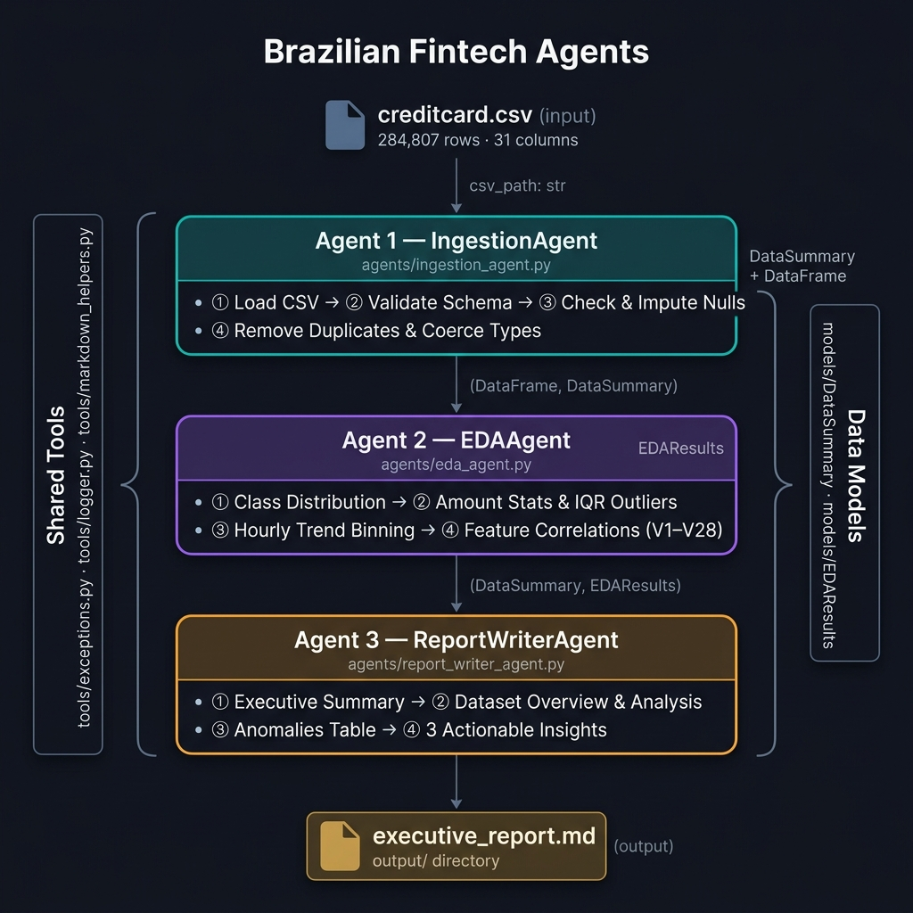
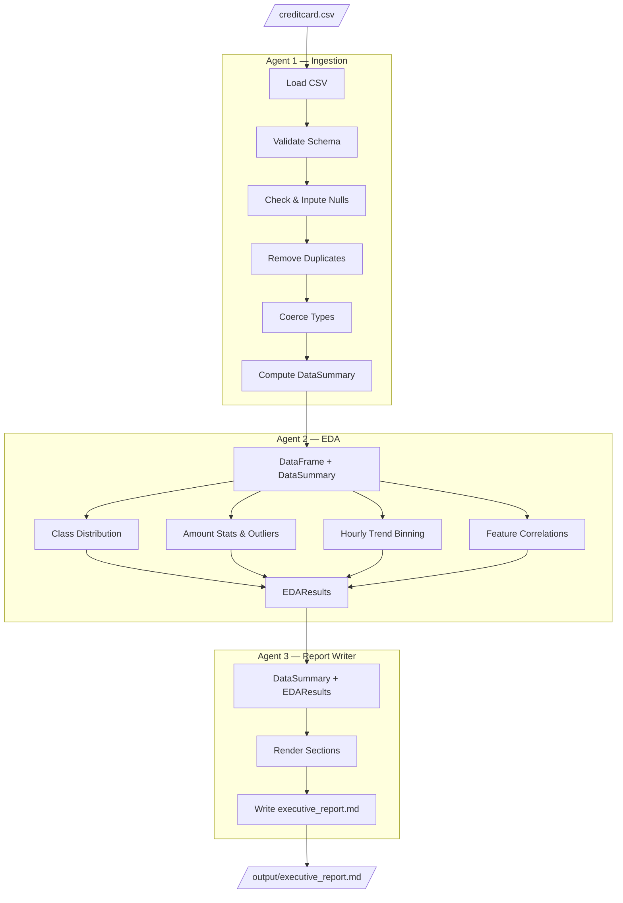

# Design Document — Brazilian Fintech Agents

> **Status:** Draft  
> **Version:** 0.1.0  
> **Date:** 2026-09-13  
> **References:** [spec.md](../spec/spec.md), [challenge.md](../challenge.md)

---



## 1. High-Level Architecture


The system is a **sequential data-flow pipeline** composed of three autonomous agents and one orchestrator. Each agent encapsulates its logic in a single class exposing a `.run()` method. Agents do not communicate directly — they receive inputs and return outputs through the orchestrator.

```
main.py (Orchestrator)
  │
  ├──[1] IngestionAgent.run(csv_path)
  │        └──► (DataFrame, DataSummary)
  │
  ├──[2] EDAAgent.run(df, summary)
  │        └──► EDAResults
  │
  └──[3] ReportWriterAgent.run(summary, eda_results)
           └──► writes output/executive_report.md
```

### Design Principles

| Principle | Decision |
|-----------|----------|
| **Single Responsibility** | Each agent has exactly one job; no cross-agent logic |
| **Immutable data contracts** | Agents communicate via typed dataclasses (no shared global state) |
| **Fail-fast validation** | Agent 1 raises errors early; downstream agents assume clean data |
| **Pure data flow** | No threads, queues, or async — straightforward top-to-bottom execution |
| **Testability** | Each agent can be unit-tested in isolation with mock inputs |

---

## 2. Project Module Layout

```
brazilian-fintech-agents/
│
├── challenge.md
│
├── spec/
│   └── spec.md
│
├── design/
│   └── design.md                   ← this file
│
├── dataset/
│   ├── creditcard.csv
│   └── dataset-readme.md
│
├── tools/
│   └── (shared utilities — see §6)
│
├── agents/
│   ├── __init__.py
│   ├── ingestion_agent.py          ← Agent 1
│   ├── eda_agent.py                ← Agent 2
│   └── report_writer_agent.py      ← Agent 3
│
├── models/
│   ├── __init__.py
│   ├── data_summary.py             ← DataSummary dataclass
│   └── eda_results.py              ← EDAResults dataclass
│
├── output/
│   └── executive_report.md         ← pipeline output (git-ignored)
│
├── main.py                         ← orchestrator entry point
├── requirements.txt
└── README.md
```

---

## 3. Data Contracts (Models)

All inter-agent data is passed as **Python dataclasses** for type safety and clarity.

### 3.1 `DataSummary` — output of Agent 1

```python
# models/data_summary.py
from dataclasses import dataclass, field
from typing import Dict, Tuple

@dataclass
class DateRange:
    min_time_sec: float
    max_time_sec: float
    span_hours: float

@dataclass
class AmountStats:
    min: float
    max: float
    mean: float
    std: float
    median: float

@dataclass
class DataSummary:
    shape: Tuple[int, int]                    # (rows, cols)
    dtypes: Dict[str, str]                    # col -> dtype name
    missing_values: Dict[str, int]            # col -> null count
    duplicates_removed: int
    date_range: DateRange
    class_distribution: Dict[int, int]        # {0: n_legit, 1: n_fraud}
    amount_stats: AmountStats
```

---

### 3.2 `EDAResults` — output of Agent 2

```python
# models/eda_results.py
from dataclasses import dataclass, field
from typing import Dict, List

@dataclass
class HourlyBin:
    hour_bin: int
    tx_count: int
    fraud_count: int
    fraud_rate: float

@dataclass
class AmountOutlier:
    index: int
    amount: float
    is_fraud: bool

@dataclass
class FeatureCorrelation:
    feature: str
    correlation: float           # correlation with Class column

@dataclass
class EDAResults:
    class_distribution_count: Dict[int, int]
    class_distribution_pct: Dict[int, float]
    amount_mean: float
    amount_std: float
    amount_percentiles: Dict[str, float]     # {"p25", "p50", "p75", "p95", "p99"}
    amount_outliers: List[AmountOutlier]
    hourly_trend: List[HourlyBin]
    fraud_amount_mean: float
    legit_amount_mean: float
    top_fraud_windows: List[HourlyBin]       # top-5 hours by fraud_rate
    top_correlated_features: List[FeatureCorrelation]   # top-10 by |correlation|
```

---

## 4. Agent Interface Design

All agents follow the same interface contract:

```python
class BaseAgent:
    """Abstract base for all pipeline agents."""
    VERSION: str = "0.1.0"

    def run(self, *args, **kwargs):
        raise NotImplementedError
```

---

### 4.1 Agent 1 — `IngestionAgent`

```python
# agents/ingestion_agent.py

class IngestionAgent(BaseAgent):
    """
    Responsible for loading, validating, cleaning, and summarizing
    the raw transaction CSV file.
    """
    VERSION = "0.1.0"

    REQUIRED_COLUMNS = ["Time", "Amount", "Class"] + [f"V{i}" for i in range(1, 29)]
    NULL_THRESHOLD_PCT = 0.20   # raise error if any col > 20% null

    def run(self, csv_path: str) -> tuple[pd.DataFrame, DataSummary]:
        """
        Parameters:
            csv_path (str): Absolute or relative path to creditcard.csv

        Returns:
            df (pd.DataFrame): Cleaned dataframe ready for EDA
            summary (DataSummary): Basic statistics on the loaded data

        Raises:
            FileNotFoundError: if csv_path does not exist
            SchemaValidationError: if required columns are missing
            DataQualityError: if null threshold exceeded in any column
        """
        ...
```

**Internal method breakdown:**

| Method | Responsibility |
|--------|---------------|
| `_load(csv_path)` | Read CSV with `pd.read_csv`; handle file-not-found |
| `_validate_schema(df)` | Assert all `REQUIRED_COLUMNS` are present |
| `_check_nulls(df)` | Count nulls; raise if any column exceeds threshold |
| `_impute_nulls(df)` | Fill numeric nulls with column median |
| `_remove_duplicates(df)` | Drop duplicate rows; count removed |
| `_coerce_types(df)` | Cast `Class` to `int`, `Amount`/`Time` to `float64` |
| `_compute_summary(df, n_dupes)` | Build and return `DataSummary` |

---

### 4.2 Agent 2 — `EDAAgent`

```python
# agents/eda_agent.py

class EDAAgent(BaseAgent):
    """
    Responsible for exploratory data analysis on the cleaned transaction
    dataframe. Produces structured statistics for the report writer.
    """
    VERSION = "0.1.0"

    TOP_FRAUD_WINDOWS = 5           # number of top fraud-rate hours to report
    TOP_FEATURES = 10               # number of top correlated features to report
    IQR_MULTIPLIER = 3.0            # outlier threshold: Q3 + k*IQR

    def run(self, df: pd.DataFrame, summary: DataSummary) -> EDAResults:
        """
        Parameters:
            df (pd.DataFrame): Cleaned dataframe from IngestionAgent
            summary (DataSummary): Metadata from IngestionAgent

        Returns:
            EDAResults: Full set of analysis metrics
        """
        ...
```

**Internal method breakdown:**

| Method | Responsibility |
|--------|---------------|
| `_class_distribution(df)` | Count and percentage per class |
| `_amount_stats(df)` | Mean, std, and percentiles of Amount |
| `_detect_amount_outliers(df)` | IQR-based outlier detection on Amount |
| `_compute_hourly_trend(df)` | Bin `Time` into 1-hour windows; count tx and fraud per bin |
| `_fraud_amount_comparison(df)` | Mean Amount for fraud vs. legitimate |
| `_top_fraud_windows(hourly_trend)` | Sort bins by fraud_rate desc; return top-N |
| `_feature_correlations(df)` | Correlate V1–V28 with Class; sort by absolute value |

**Anomaly detection strategy — IQR method:**

```
Q1 = Amount.quantile(0.25)
Q3 = Amount.quantile(0.75)
IQR = Q3 - Q1
upper_bound = Q3 + (IQR_MULTIPLIER * IQR)  # 3.0 * IQR

outliers = df[df["Amount"] > upper_bound]
```

*Rationale: IQR is robust to skew and does not assume a normal distribution, which is appropriate for transaction amounts that are heavily right-skewed. The 3× multiplier reduces false positives on legitimate high-value transactions.*

---

### 4.3 Agent 3 — `ReportWriterAgent`

```python
# agents/report_writer_agent.py

class ReportWriterAgent(BaseAgent):
    """
    Responsible for assembling and writing the executive Markdown report
    from the structured outputs of Agents 1 and 2.
    """
    VERSION = "0.1.0"
    OUTPUT_DIR = "./output"
    OUTPUT_FILE = "executive_report.md"

    def run(self, summary: DataSummary, eda: EDAResults) -> str:
        """
        Parameters:
            summary (DataSummary): From IngestionAgent
            eda (EDAResults): From EDAAgent

        Returns:
            output_path (str): Absolute path to the written report file
        """
        ...
```

**Internal method breakdown:**

| Method | Responsibility |
|--------|---------------|
| `_render_executive_summary(summary, eda)` | Top-level paragraph with fraud rate and dataset scope |
| `_render_dataset_overview(summary)` | Shape, time span, class balance table |
| `_render_transaction_analysis(eda)` | Volume, amount distribution, temporal trend table |
| `_render_anomalies_table(eda)` | Markdown table of top-20 outlier transactions |
| `_render_insights(eda, summary)` | 3 fixed actionable insights derived from findings |
| `_render_methodology(eda)` | IQR params, correlation method, pipeline version |
| `_write_report(content)` | Create `output/` dir if needed; write the `.md` file |

---

## 5. Orchestrator — `main.py`

```python
# main.py
import argparse
from agents.ingestion_agent import IngestionAgent
from agents.eda_agent import EDAAgent
from agents.report_writer_agent import ReportWriterAgent

def main():
    parser = argparse.ArgumentParser(description="Brazilian Fintech Agents Pipeline")
    parser.add_argument("--input",  default="./dataset/creditcard.csv")
    parser.add_argument("--output", default="./output")
    args = parser.parse_args()

    print("[1/3] Running IngestionAgent...")
    df, summary = IngestionAgent().run(args.input)

    print("[2/3] Running EDAAgent...")
    eda = EDAAgent().run(df, summary)

    print("[3/3] Running ReportWriterAgent...")
    report_path = ReportWriterAgent(output_dir=args.output).run(summary, eda)

    print(f"Pipeline complete. Report written to: {report_path}")

if __name__ == "__main__":
    main()
```

**CLI usage:**

```bash
# default paths
python main.py

# custom paths
python main.py --input ./data/my_transactions.csv --output ./reports
```

---

## 6. Shared Tools (`tools/`)

| Module | Contents |
|--------|----------|
| `tools/exceptions.py` | Custom exception classes: `SchemaValidationError`, `DataQualityError` |
| `tools/logger.py` | Thin wrapper around Python `logging` for consistent log format |
| `tools/markdown_helpers.py` | Utility functions for building Markdown tables and sections |

---

## 7. Error Handling Strategy

| Error | Where raised | Behavior |
|-------|-------------|----------|
| `FileNotFoundError` | `IngestionAgent._load()` | Logged + re-raised; pipeline stops |
| `SchemaValidationError` | `IngestionAgent._validate_schema()` | Logged + re-raised; pipeline stops |
| `DataQualityError` | `IngestionAgent._check_nulls()` | Logged + re-raised; pipeline stops |
| `Exception` (unexpected) | `main.py` try/except wrapper | Logged with traceback; exit code 1 |

---

## 8. Dependency List

```
# requirements.txt
pandas>=2.0.0
numpy>=1.26.0
scipy>=1.13.0
```

> No LLM dependencies. No API keys. No external services.

---

## 9. Architecture Diagram (Mermaid)



---

## 10. Open Design Decisions

| # | Decision | Options | Status |
|---|----------|---------|--------|
| OD-1 | Save intermediate artifacts (cleaned CSV, EDA JSON)? | Yes / No | Open |
| OD-2 | Number of rows in anomaly table | Top-10 / Top-20 / All | Defaulting to 20 |
| OD-3 | Customer proxy grouping strategy | Amount bucket / V-feature cluster | Open |
| OD-4 | Logging verbosity | Silent / INFO / DEBUG flag | Defaulting to INFO |
